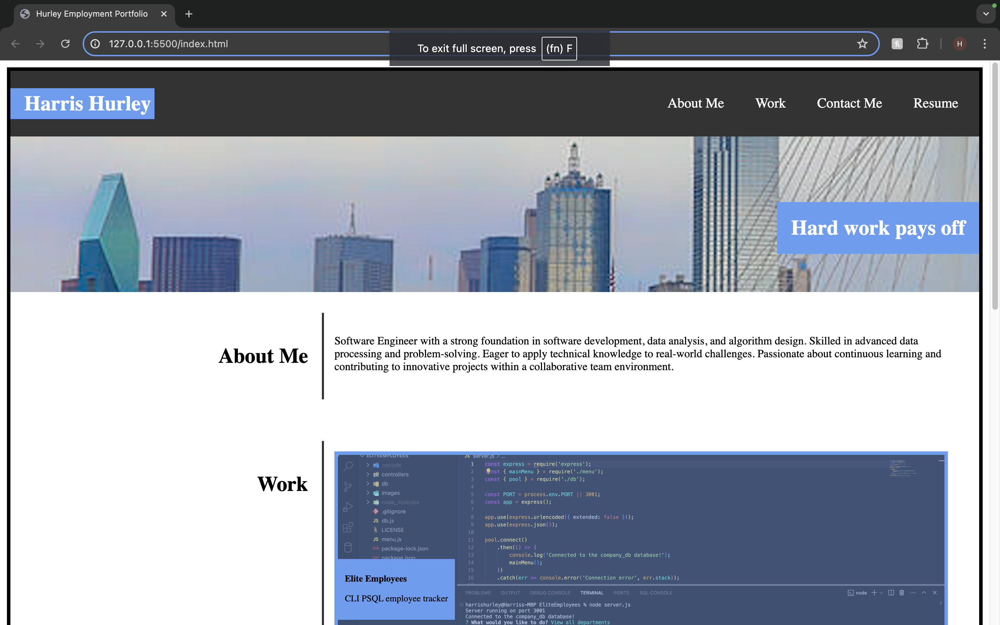
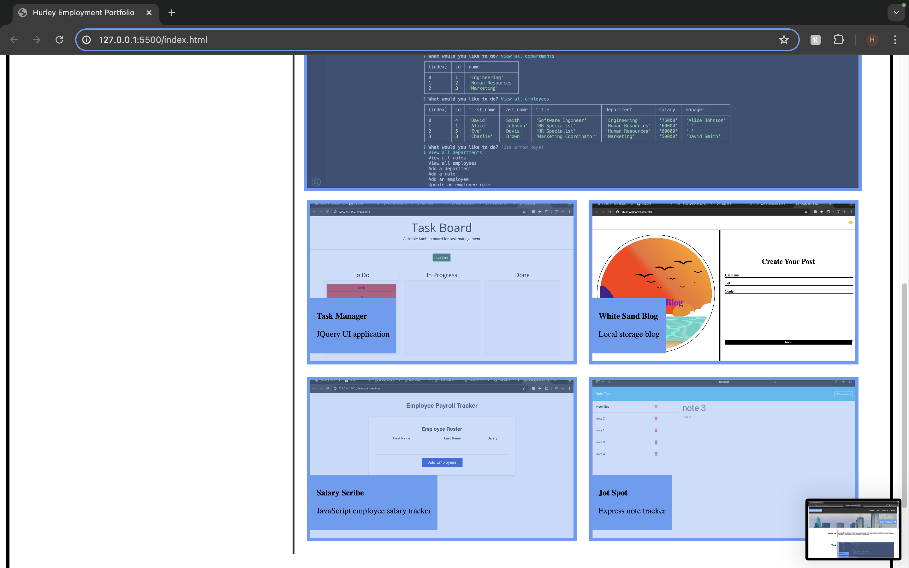
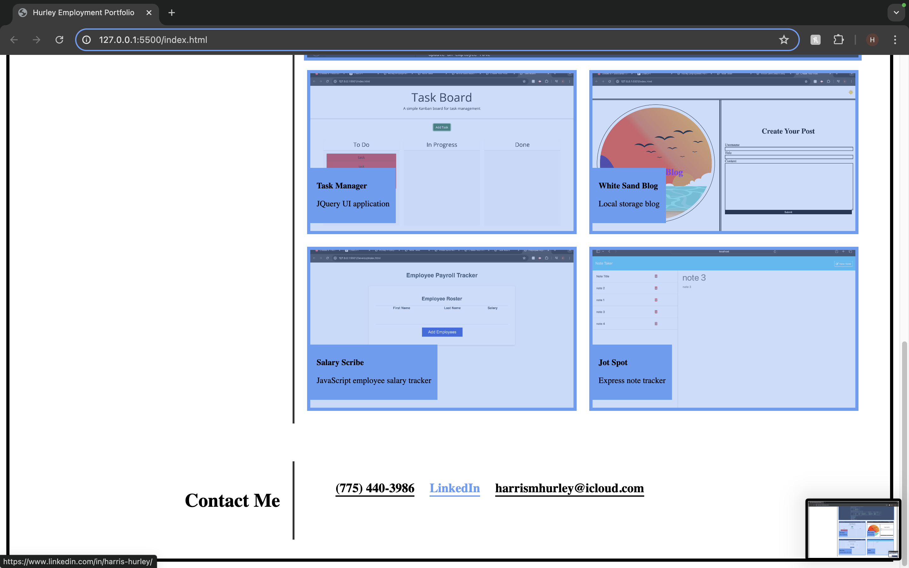

# EmploymentPortfolio

    
## Description

This project is a personal employment portfolio website designed to showcase skills, work experience, and contact information. Built using only HTML and CSS, this website demonstrates a clean and responsive layout suitable for presenting professional achievements and career information.

## Deployed Application URL

[EmploymentPortfolio](https://harrismhurley.github.io/Employment-Portfolio/)

## Table of Contents
* [Credits](#credits)
* [Features](#features)
* [Dependencies](#dependencies)
* [Screenshots](#screenshots)
* [How to Contribute](#how-to-contribute)
* [Tests](#tests)
* [License](#license)

## Credits

N/A

## Features

- Home Section: Introduces the portfolio with a visually engaging header image and a brief quote.
- About Me Section: Provides detailed information about the user's background, skills, and qualifications.
- Work Section: Highlights various projects and work experiences with image-based content blocks.
- Contact Section: Displays contact information and social media links for easy communication.
- Responsive Design: Ensures that the website is viewable and functional across different devices and screen sizes.

## Dependencies

N/A

## Screenshots

## How to Contribute
If you would like to contribute you can contact me [Via Email](mailto:harrismhurley@icloud.com?subject=[GitHub]%20Dev%20Connect) or visit [github](https://github.com/harrismhurley).

## Tests

N/A
